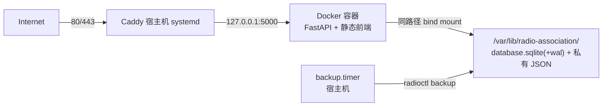

# 首次部署方案：Docker + Caddy

**适用场景**：服务器尚未部署过本系统，从零开始的首次部署。本文档取代 `docs/DOCKER_MIGRATION_PLAN.md`（该计划假设已存在 systemd + Nginx 部署，不适用于全新服务器）以及全部 Nginx 相关部署脚本，见第 10 节。

**执行须知**：按顺序执行，每步有验证命令，验证失败不要带病推进。除特别说明外，命令均在 root shell 执行——Ubuntu 根账户默认锁定，用 `sudo -i` 进入（**不要**用 `su -`，root 无密码可验）。文中 `__DOMAIN__` 替换为实际域名（如 `wuxie.luciangray.net`），`__SHA__` 替换为 40 位 commit SHA。

## 0. 目标架构



| 决策 | 选择 | 理由 |
|---|---|---|
| 应用形态 | 单容器：FastAPI + `public/` 静态文件 | 本仓库无独立前端进程，`backend/app.py` 直接挂载 `../public`；Dockerfile 保持仓库两层布局使该相对路径生效 |
| 编排 | Docker Compose v2，镜像 tag = commit SHA | 单容器无需更重编排；回滚 = 换回旧 tag |
| 镜像构建 | **开发机本地 `docker build`，`docker save \| ssh … docker load` 传输** | 服务器 2 GB 内存不承受构建负载；服务器无需访问 Docker Hub；部署完整性由镜像 ID 双侧核对保证（开发机与服务器同为 linux/amd64，无需 buildx 跨平台构建） |
| 数据 | **整目录** bind mount `/var/lib/radio-association` | WAL 模式下 `-wal`/`-shm` 旁挂文件与库文件同生共死，**禁止单文件挂载**；同路径挂载使宿主机备份脚本原样可见数据 |
| 容器身份 | `user: APP_UID:APP_GID`（宿主机 `radio-association` 用户） | 保证容器写出的文件属主不变，宿主机备份/恢复不受影响 |
| 反代与证书 | Caddy（宿主机 systemd），自动 ACME 签发/续期 | 取代 Nginx + certbot + 续期钩子整套机制 |
| 端口 | 公网仅 22/80/443；容器发布 `127.0.0.1:5000`；预生产入口 `127.0.0.1:8080` | 应用端口永不暴露公网 |
| 备份 | 宿主机 `radio-association-backup.timer` → `radioctl backup` | 只操作数据库文件，与应用运行形态无关 |

## 1. 前置条件

- 服务器：腾讯云香港轻量，Ubuntu 24.04，2 vCPU / 2 GB 内存，linux/amd64。**服务器上不构建镜像**。
- DNS：`*__DOMAIN__*` 的 A 记录已指向服务器公网 IP。**Caddy 首次签发证书要求 80/443 公网可达**，先在腾讯云控制台防火墙开放 22、80、443（TCP）；另开放 **443/UDP** 以启用 HTTP/3 (QUIC)——丢包较高的跨境链路上明显改善体验。
- 开发机准备（linux/amd64，安装 Docker 即可，无需 buildx）：
  - 确定首次部署的 commit SHA（`git rev-parse HEAD`）。
  - 生成 JWT 密钥：`openssl rand -hex 32`。
  - 选定负责人明文密码（写入 `/etc/radio-association/app.env`，仅限服务器受限保存）。
  - 准备招新配置：复制 `backend/config/recruitment.example.json` 按需修改（首次上线保持 `application.enabled=false`、`admissionQuery.enabled=false` 即可）。

## 2. 服务器初始化

### 2.1 用户与目录

```bash
useradd --system --home /nonexistent --shell /usr/sbin/nologin radio-association
install -d -o radio-association -g radio-association -m 0750 \
    /var/lib/radio-association /var/lib/radio-association/data \
    /var/lib/radio-association/private /var/lib/radio-association/state
install -d -m 0750 /etc/radio-association
install -d -m 0750 /var/backups/radio-association
id radio-association   # 记录 UID:GID，第 4 步要用
```

### 2.2 安装 Docker

```bash
apt-get update
apt-get install -y docker.io docker-compose-v2
systemctl enable --now docker
usermod -aG docker admin   # 让运维用户直接执行 docker 命令（镜像传输、排查看日志），重新登录后生效
docker version && docker compose version
```

若 `docker-compose-v2` 包不存在，用 `apt-cache search compose` 找替代包名。

注意：`docker` 组成员等价于 root 权限（可挂载宿主机任意文件起容器）。本服务器为专用单机、`admin` 即运维账户，属标准做法；多用户共享机器不要这样做。根账户在 Ubuntu 默认锁定，`su -` 不可用，本文档所有 root 操作均通过 `sudo` 或直接 root shell 完成。

### 2.3 安装 Caddy

```bash
apt-get install -y debian-keyring debian-archive-keyring apt-transport-https curl
curl -1sLf 'https://dl.cloudsmith.io/public/caddy/stable/gpg.key' | \
    gpg --dearmor -o /usr/share/keyrings/caddy-stable-archive-keyring.gpg
curl -1sLf 'https://dl.cloudsmith.io/public/caddy/stable/debian.deb.txt' \
    > /etc/apt/sources.list.d/caddy-stable.list
apt-get update && apt-get install -y caddy
systemctl is-active caddy   # 预期 active（默认站点，稍后替换）
```

### 2.4 安装备份工具

```bash
# 先在服务器上获取源码（见第 3.1 节），再执行：
install -m 0755 /opt/radio-association/docker/src/deployment/radioctl /usr/local/sbin/radioctl
install -D -m 0755 /opt/radio-association/docker/src/scripts/ops/sqlite_backup.py \
    /usr/local/lib/radio-association/sqlite_backup.py
install -m 0644 /opt/radio-association/docker/src/deployment/systemd/radio-association-backup.service \
    /opt/radio-association/docker/src/deployment/systemd/radio-association-backup.timer \
    /etc/systemd/system/
systemctl daemon-reload
systemctl enable --now radio-association-backup.timer
```

（可选）如需备份上传 OSS，复制 `deployment/backup.env.example` 为 `/etc/radio-association/backup.env` 并填写 `OSS_BACKUP_URI`。

## 3. 应用配置

### 3.1 获取源码（运维文件来源）

服务器上的克隆**不用于构建**，只提供 compose 文件、radioctl、备份脚本和配置示例，且与部署版本锚定：

```bash
mkdir -p /opt/radio-association/docker
git clone <仓库地址> /opt/radio-association/docker/src
cd /opt/radio-association/docker/src
git checkout __SHA__
[[ "$(git rev-parse HEAD)" == "__SHA__" ]] || { echo "HEAD 与目标 SHA 不符，终止"; exit 1; }
```

之后每次发布都显式 checkout + 核对 SHA，保证服务器上的运维文件与运行版本一致。

### 3.2 `/etc/radio-association/app.env`

```bash
install -m 0640 -o root -g radio-association /dev/null /etc/radio-association/app.env
cat > /etc/radio-association/app.env <<'EOF'
JWT_SECRET=<第1步生成的64位十六进制>
OFFICER_USERNAME=<负责人登录用户名>
OFFICER_PASSWORD=<负责人明文密码>
DATABASE_PATH=/var/lib/radio-association/data/database.sqlite
RECRUITMENT_CONFIG_PATH=/var/lib/radio-association/private/recruitment.json
ADMISSIONS_DATA_PATH=/var/lib/radio-association/private/admissions.json
BACKUP_STATUS_PATH=/var/lib/radio-association/state/backup-status.json
EOF
```

### 3.3 招新配置（启动必需）

应用启动时强制加载 `recruitment.json`，缺失则拒绝启动：

```bash
install -o radio-association -g radio-association -m 600 \
    /opt/radio-association/docker/src/backend/config/recruitment.example.json \
    /var/lib/radio-association/private/recruitment.json
```

录取名单 `admissions.json` 在 `admissionQuery.enabled=false` 时**不需要**存在，首次上线可跳过；启用录取查询时按第 8.5 节发布。

## 4. 构建镜像（开发机）并启动（服务器）

### 4.1 开发机：构建并传输镜像

在仓库根目录（先 `git checkout __SHA__` 并核对 HEAD）：

```bash
# 构建上下文必须是仓库根目录（Dockerfile 依赖 backend/ 与 public/ 的两层布局）
docker build -f deployment/docker/Dockerfile -t radio-association:__SHA__ .

# 记录本地镜像 ID，用于传输后核对
docker image inspect --format '{{.Id}}' radio-association:__SHA__

# 传输（镜像约 200-400 MB，gzip 压缩后更小；admin@<服务器> 换成实际登录方式）
# 前提：admin 已加入 docker 组（见 2.2）；不要试图用 su，Ubuntu 根账户默认锁定
docker save radio-association:__SHA__ | gzip | \
    ssh admin@<服务器> "gunzip | docker load"
```

不使用镜像仓库：服务器不依赖 Docker Hub 或任何 registry 的可达性，完整性由镜像 ID 核对保证。

### 4.2 服务器：核对并启动

```bash
docker image inspect --format '{{.Id}}' radio-association:__SHA__
# 必须与 4.1 记录的本地镜像 ID 完全一致，不一致则重新传输，不要用残缺的镜像启动

cd /opt/radio-association/docker/src/deployment/docker
{
  printf 'RADIO_SHA=%s\n' '__SHA__'
  printf 'APP_UID=%s\n' "$(id -u radio-association)"
  printf 'APP_GID=%s\n' "$(id -g radio-association)"
} > .env
cat .env   # 三个值均非空

docker compose up -d --no-build   # 镜像缺失时报错退出；compose.yaml 带 build 段，不加此旗标会在服务器静默构建
sleep 5
curl --fail http://127.0.0.1:5000/healthz && echo
docker ps --filter name=radio-association   # STATUS 应变 healthy
ls -l /var/lib/radio-association/data/      # database.sqlite 属主应为 radio-association
```

应用启动时自动建表（WAL 模式）。`ls` 若显示 root 属主，说明 `.env` 的 `APP_UID/APP_GID` 错了，修正后 `docker compose up -d` 重建容器。

注意：这里的 `.env` 与 3.2 节的 `app.env` 是**两个文件**，不要混淆：

| | `deployment/docker/.env` | `/etc/radio-association/app.env` |
|---|---|---|
| 谁读取 | 宿主机上的 compose CLI，解析 compose.yaml 时（在 compose.yaml 所在目录自动查找，无需参数指定） | 容器内的应用进程，启动时经 yaml 的 `env_file` 指令注入 |
| 装什么 | `RADIO_SHA`/`APP_UID`/`APP_GID`，仅用于替换 yaml 里的 `${…}` | JWT 密钥、负责人账号哈希、私有文件路径等应用配置 |
| 怎么来 | 手动创建，git 未跟踪，`git checkout` 切版本不影响它；发布时按 8.1 用 `sed` 更新 `RADIO_SHA` | 首次部署 `install` 自 `app.env.example`，之后基本不变 |

## 5. 种子数据（仅首次）

`association`、`departments`、`competitions`、`honors`、`trainings` 五张静态表由 `scripts/init-db.js` 播种（需要 Bun，用一次性容器，不在宿主机装 Bun）。这是服务器上**唯一**需要拉取的镜像；若服务器拉不动 Docker Hub，在开发机执行 `docker save oven/bun:1 | gzip | ssh … docker load` 同法传输，或在宿主机直接装 Bun 运行：

```bash
docker run --rm \
    --user "$(id -u radio-association):$(id -g radio-association)" \
    -v /opt/radio-association/docker/src:/src -w /src \
    -v /var/lib/radio-association:/var/lib/radio-association \
    -e DATABASE_PATH=/var/lib/radio-association/data/database.sqlite \
    oven/bun:1 scripts/init-db.js
```

**警告**：该脚本先清空再插入，是破坏性操作，只在首次部署执行一次。执行后浏览公开页面确认数据出现。

## 6. Caddy 配置

Caddyfile 模板已提交在仓库 `deployment/caddy/Caddyfile.template`（注释内含与旧 Nginx 模板的行为对照），从服务器克隆安装，**不要手工粘贴整段配置**（粘贴断行会导致 `caddy validate` 报 `unexpected line ending` 一类的解析错误）：

```bash
install -d -o caddy -g caddy -m 0755 /var/log/caddy
sed 's/__DOMAIN__/__DOMAIN__/g' \
    /opt/radio-association/docker/src/deployment/caddy/Caddyfile.template \
    > /etc/caddy/Caddyfile
caddy fmt --overwrite /etc/caddy/Caddyfile   # 顺带规范化缩进，解析失败会在此暴露
runuser -u caddy -- caddy validate --config /etc/caddy/Caddyfile --adapter caddyfile
rm -f /var/log/caddy/radio-association.access.log   # 若曾以 root 跑过 validate/caddy：它会以 root 属主创建日志文件，导致服务 EACCES，删掉让服务以 caddy 身份重建
systemctl start caddy      # 首次部署；服务已在运行时改配置用 systemctl reload caddy
```

（上面 `sed` 第二个 `__DOMAIN__` 替换为实际域名，如 `wuxie.luciangray.net`。`reload` 只对运行中的服务有效，服务未启动时会报 `caddy.service is not active`，此时一律用 `start`。）

证书签发验证（Caddy 自动完成，通常几秒内）：

```bash
curl -fsSI https://__DOMAIN__/ | head -3          # 预期 200/302，证书有效
curl -s http://__DOMAIN__/ | head -1               # 预期 308 跳转 HTTPS
journalctl -u caddy -n 50 --no-pager               # 确认无 obtain 错误
```

与原 Nginx 方案的行为对照：HTTP→HTTPS 跳转、证书签发续期由 Caddy 自动完成；`X-Forwarded-For/Proto` 由 `reverse_proxy` 自动设置（容器内 uvicorn 已配 `--proxy-headers --forwarded-allow-ips 127.0.0.1`）；请求体上限、`/ops/` 与隐藏文件 404、安全响应头一一对应。限流在应用层（`backend/utils/security.py`），不受影响。

## 7. 首次上线验收清单

- [ ] `docker ps` 容器 `healthy`，`docker logs radio-association --tail 50` 无异常
- [ ] `caddy` 与 `docker` 均 `systemctl is-active` 为 active
- [ ] `ss -ltnp`：公网仅 22/80/443，5000 与 8080 只监听 `127.0.0.1`
- [ ] `https://__DOMAIN__/` 首页、关于、活动、竞赛、培训、荣誉页正常且有种子数据
- [ ] HTTP 访问自动跳转 HTTPS，证书为 Let's Encrypt 有效证书
- [ ] `https://__DOMAIN__/ops/` 返回 404；`curl http://127.0.0.1:5000/healthz` 返回 `{"ok":true}`
- [ ] 负责人登录页可登录，后台申请列表正常（此时为空）
- [ ] 入会申请页按 `recruitment.json` 的开关状态正确展示
- [ ] 手动 `radioctl backup` 成功，`/var/backups/radio-association/` 出现新备份，`curl http://127.0.0.1:5000/ops/backupz` 返回 ok
- [ ] `systemctl list-timers radio-association-backup.timer` 有下次执行时间
- [ ] `docker restart radio-association` 后 30 秒内 `/healthz` 恢复
- [ ] 容器内触发一次真实写入（如后台登录）后，`ls -l /var/lib/radio-association/data/` 中 `-wal` 文件属主为 `radio-association`

## 8. 日常运维

### 8.1 发布新版本

```bash
# 开发机：构建 + 传输（同 4.1）
git checkout <新SHA> && git rev-parse HEAD   # 核对
docker build -f deployment/docker/Dockerfile -t radio-association:<新SHA> .
docker image inspect --format '{{.Id}}' radio-association:<新SHA>   # 记录
docker save radio-association:<新SHA> | gzip | \
    ssh admin@<服务器> "gunzip | docker load"
```

```bash
# 服务器：
radioctl backup                                        # 发布前备份
docker image inspect --format '{{.Id}}' radio-association:<新SHA>   # 与开发机核对
cd /opt/radio-association/docker/src
git fetch origin
git checkout <新SHA>
[[ "$(git rev-parse HEAD)" == "<新SHA>" ]] || { echo "SHA 不符，终止"; exit 1; }
cd deployment/docker
sed -i 's/^RADIO_SHA=.*/RADIO_SHA=<新SHA>/' .env
docker compose up -d --no-build
sleep 5 && curl --fail http://127.0.0.1:5000/healthz   # 失败则按 8.2 回滚
```

### 8.2 回滚

旧镜像仍在本地，无需重新构建：

```bash
cd /opt/radio-association/docker/src/deployment/docker
radioctl backup
sed -i 's/^RADIO_SHA=.*/RADIO_SHA=<旧SHA>/' .env
docker compose up -d --no-build
sleep 5 && curl --fail http://127.0.0.1:5000/healthz
```

保留最近 2 个镜像 tag 供回滚，更旧的用 `docker image prune -f` 及手动 `docker rmi` 清理。

### 8.3 备份

- 自动：`radio-association-backup.timer` 每日 03:00（Asia/Shanghai，随机延迟 20 分钟），保留 14 天。
- 手动：`radioctl backup`。
- 备份含 SHA-256 校验文件；`backup-status.json` 由 `/ops/backupz` 暴露给健康检查，超过 30 小时无成功备份会报警（503）。

### 8.4 数据库恢复

**WAL 模式下不能热替换，必须先停容器：**

```bash
cd /opt/radio-association/docker/src/deployment/docker
docker compose stop
python3 /usr/local/lib/radio-association/sqlite_backup.py restore \
    /var/backups/radio-association/<准确文件名>.sqlite \
    /var/lib/radio-association/data/database.sqlite \
    /var/backups/radio-association
chown radio-association:radio-association /var/lib/radio-association/data/database.sqlite
chmod 640 /var/lib/radio-association/data/database.sqlite
docker compose start
sleep 5 && curl --fail http://127.0.0.1:5000/healthz
radioctl backup   # 恢复后立即做一次备份
```

注意：`radioctl` 只保留 `backup` 子命令，恢复必须走上述手动流程（`sqlite_backup.py restore`）。

### 8.5 更新招新配置 / 录取名单

首选网页后台操作（实时生效、自动备份旧文件）。后台不可用时的应急路径（以招新配置为例）：

```bash
# 1. 把新文件传到服务器 /tmp 并校验（借用容器内的应用代码）
chmod 644 /tmp/recruitment.json
docker cp /tmp/recruitment.json radio-association:/tmp/recruitment.json
docker exec --workdir /app/backend \
    -e RECRUITMENT_CONFIG_PATH=/tmp/recruitment.json \
    radio-association .venv/bin/python -c \
    'from config.recruitment import load_recruitment_config; load_recruitment_config()'

# 2. 原子替换 + 重启
install -o radio-association -g radio-association -m 600 \
    /tmp/recruitment.json /var/lib/radio-association/private/recruitment.json.new
mv /var/lib/radio-association/private/recruitment.json.new \
    /var/lib/radio-association/private/recruitment.json
docker restart radio-association
sleep 5 && curl --fail http://127.0.0.1:5000/healthz   # 失败则从 .previous.* 或备份恢复后重启
rm -f /tmp/recruitment.json
```

录取名单同理：校验命令改为 `from routes.admissions import load_admissions; load_admissions("/tmp/admissions.json")`（环境变量换成 `ADMISSIONS_DATA_PATH`），目标路径 `/var/lib/radio-association/private/admissions.json`。名单来源是本地 Excel 经 `bun scripts/export-admissions.js` 转换。

### 8.6 状态查看

```bash
docker ps --filter name=radio-association
docker logs radio-association --tail 100
curl -s http://127.0.0.1:5000/healthz && echo
curl -s http://127.0.0.1:5000/ops/backupz && echo
cat /opt/radio-association/docker/src/deployment/docker/.env   # 当前部署 SHA
systemctl list-timers radio-association-backup.timer
journalctl -u caddy -n 50 --no-pager
ss -ltnp
```

## 9. 风险与注意事项

| 风险 | 缓解 |
|---|---|
| 单文件挂载 SQLite 导致 WAL 数据丢失 | 只整目录挂载 `/var/lib/radio-association`（compose 已固定） |
| 容器写文件属主变 root | compose 固定 `user: APP_UID:APP_GID`；验收清单最后一项实测 |
| 忘记停容器直接恢复数据库 | 8.4 流程强制 `docker compose stop` 在前 |
| 5000/8080 暴露公网 | compose 绑定 `127.0.0.1`；验收含 `ss -ltnp` 检查 |
| 构建镜像架构与服务器不符 | 开发机与服务器同为 linux/amd64 时普通 `docker build` 即可；将来换 ARM 机器再用 `docker buildx build --platform linux/amd64 … --load .`。启动后 `docker logs` 出现 `exec format error` 即架构错了 |
| 镜像传输损坏 | 4.1/4.2 双侧核对镜像 ID，不一致重新传输 |
| 服务器拉不动 Docker Hub | 应用镜像走 `docker save/load` 不依赖 registry；唯一例外是第 5 节的 `oven/bun:1`，可同法传输或宿主机装 Bun |
| 服务器访问 GitHub 不稳定 | 服务器克隆只取运维文件；不可达时用 `scp` 把 `deployment/`、`scripts/ops/`、`backend/config/recruitment.example.json` 按 3.1 的目录结构上传替代 |
| Caddy 首次签发证书失败 | 确认 DNS 已生效且 80/443 公网可达后再启动；失败排查看 `journalctl -u caddy` |
| Caddy 启动报日志文件 `permission denied` | root 身份跑过 `caddy validate` 会以 root 属主创建 `/var/log/caddy/*.log`；删掉该文件再 `systemctl start caddy`。验证配置用 `runuser -u caddy -- caddy validate ...` |
| `radioctl` 旧子命令 | deploy/rollback/restore/configure/admissions 已随 systemd 发布模型移除；`radioctl` 只剩 `backup` |

## 10. 被本方案取代的旧资产

以下旧模型资产已随方案切换处置：

- `scripts/bootstrap-server.sh`、`scripts/configure-public-site.sh`、`scripts/radio-remote.ps1`、`scripts/ops/reload-radio-nginx.sh`、`deployment/nginx/`：已删除（整体围绕 Nginx sites-available + certbot，由第 2 节初始化与第 6 节 Caddyfile 取代）。
- `deployment/systemd/radio-association.service`：应用不再由 systemd 直接运行，文件仅作历史保留；备份 timer/service 仍在使用。
- `radioctl` 的 `deploy/rollback/restore/configure/admissions/status` 子命令：已移除，脚本缩减为 `backup` 单入口。
- `docs/DOCKER_MIGRATION_PLAN.md`、`docs/HANDOVER_GUIDE.md`、`docs/HANDOVER_CHECKLIST.md`：已删除（迁移计划面向从未实施的旧架构；交接文档随维护模式变化废止）。
- `docs/DEPLOYMENT_AND_OPERATIONS.md`、`docs/OPERATIONS_QUICK_REFERENCE.md`：已按 Docker + Caddy 架构重写。
- `backend/tests/test_deployment_tooling.py`：已改写为断言 compose 与 Caddyfile。
