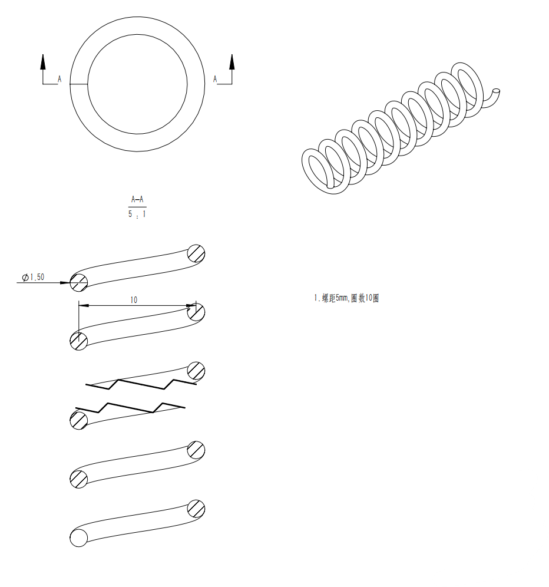
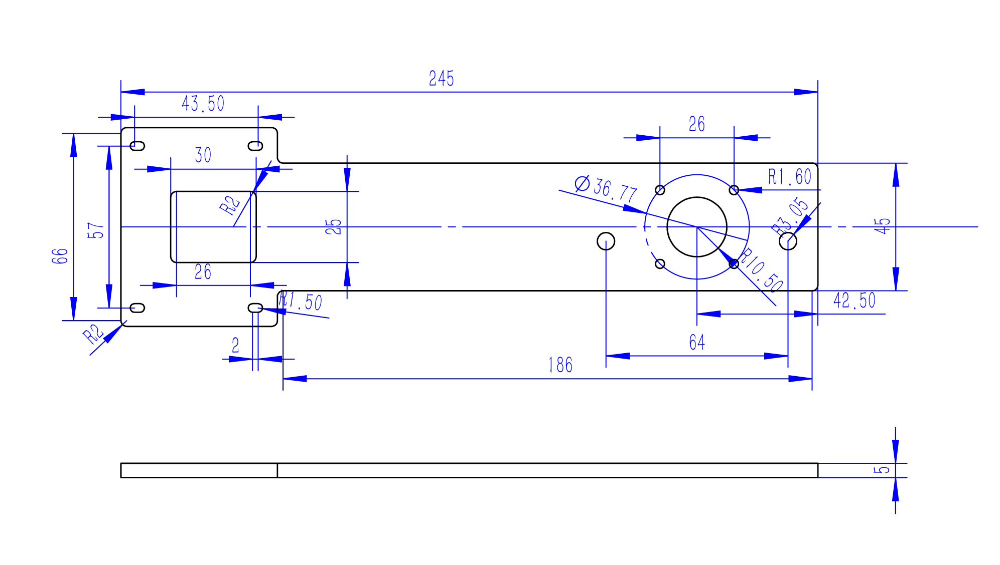
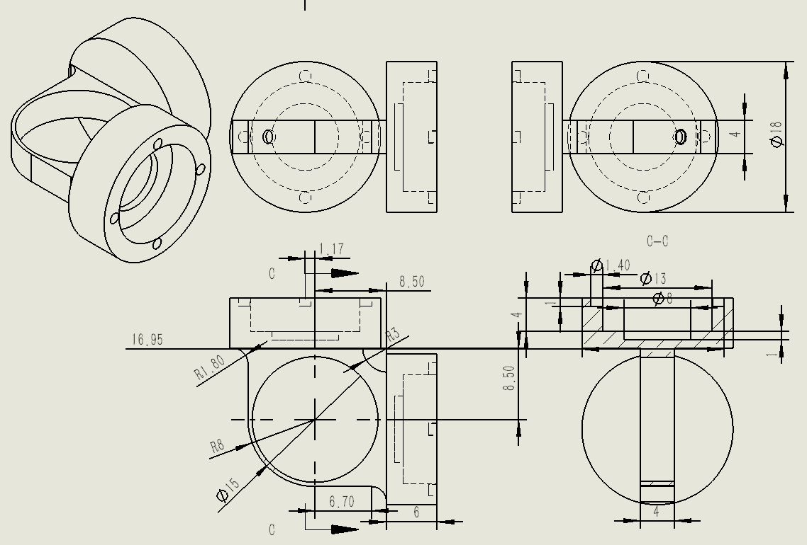
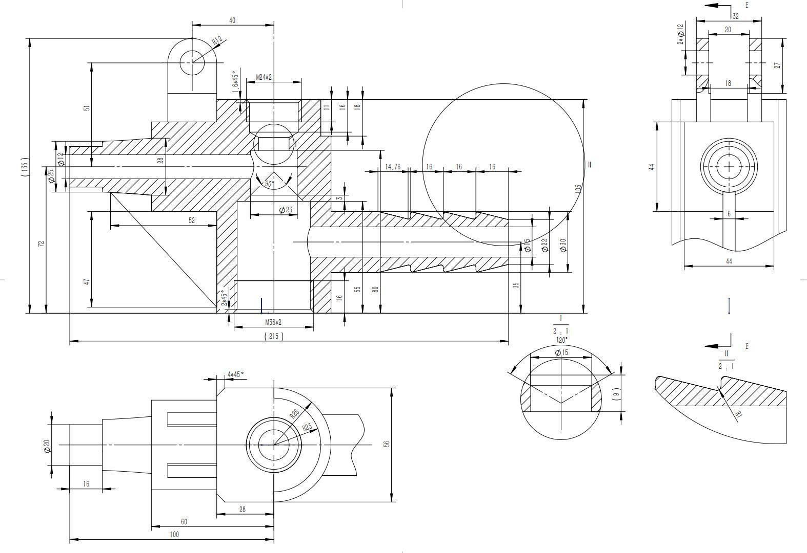

# 机械部招新面试题
> 用 soildworks 完成下面工程图的三维建模，并且打包成一个文件夹发至邮箱 **shenchenglong555@qq.com**
>
> 文件夹命名：专业+姓名

## 题目解释：题1与题2，必须完成。题3与题4不要求全部完成，将根据完成程度打分。

## 题目1 弹簧（提示：需要学习扫描和插入螺旋线） 15分

## 题目2 相机支架  15分

## 题目3  30分

## 题目4  40分
