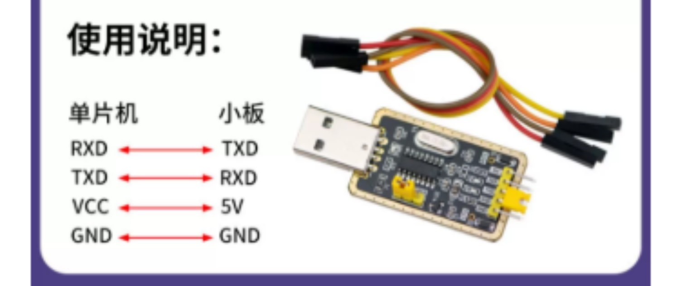
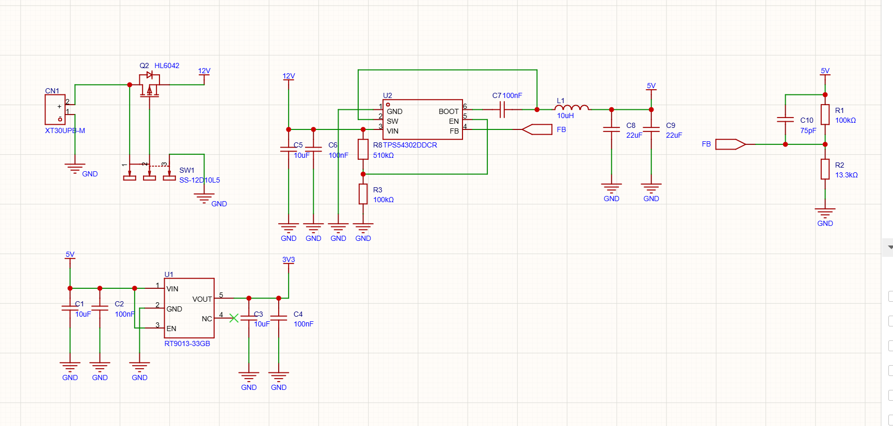
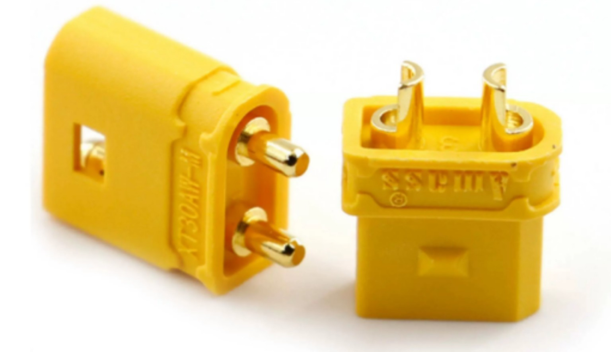
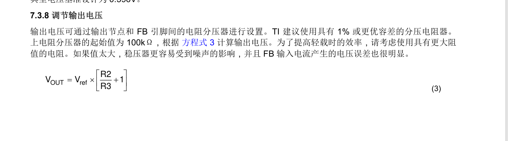

**1.** 需要手动按动的机械开关如果想在一秒内开关上千次是不可能的，但是依据电平电压差的电开关MOS管则可以轻易做到，所以往往用在驱动，或者在直流电压变换中作为开关，请去查找MOS管的三个级各自是什么，并写出两种MOS管如何区分？两者导通条件是什么？

（B站视频【NMOS和PMOS】<https://www.bilibili.com/video/BV1fKu96gETC?vd_source=9d31a29fa90089a41634ad7c39533fa6>

【MOS管的开关控制 该用哪个？】<https://www.bilibili.com/video/BV1By411B7j7?vd_source=9d31a29fa90089a41634ad7c39533fa6>）

---

**2.** 在函数内部定义一个局部变量时加上 static 关键字（例如 static int cnt = 0;），请问这个变量和普通局部变量（int cnt = 0;）最大的不同点是什么？（这类问题可以直接问ai得到答案，但是最好去写一写用一用，这个视频的程序可以跟着写一写【C语言-静态变量static剖析，3分钟吃透static用法】<https://www.bilibili.com/video/BV15r4y1D7ZD?vd_source=9d31a29fa90089a41634ad7c39533fa6>）

---

**3.** 嵌入式会用到很多种通讯协议，比如最常用的串口通信USART 仅仅需要RX和TX不需要时钟线，又像IIC（I2C）一般给陀螺仪传或者温度传感器这种简单较少的数据，并且一根IIC能挂载很多外设，不像SPI，但是SPI能传输非常庞大的数据，彩色TFT屏幕通常使用SPI，另外在汽车工业领域使用更多的CAN总线因为是差分信号所以抗干扰性能更强，请选择以上一种通信协议（除CAN），去淘宝找应用的模块（比如USART是USB转TTL，IIC用mpu6050,SPI是TFT屏幕），说明使用时接线如何接？比如串口如下图。简要说明工作原理？

---

**4.** PWM是非常重要的，用控制舵机旋转，驱动电机转动，输出电压等众多作用，PWM有两个基本参数"频率"和"占空比"，请解释PWM的含义并解释这两个参数都是控制什么的？

并说明它是如何实现"调节 LED 亮度"或"控制电机转速"的(【搞懂什么是PWM控制】<https://www.bilibili.com/video/BV1HD4y1k74L?vd_source=9d31a29fa90089a41634ad7c39533fa6>)

---

**5.** 嵌入式往往涉及许多模块比如7.4V 310电机，5V陀螺仪模块，3V3 OLED屏幕，但是我们的电池一般都是3S锂离子电池也就是12V，所以需要我们进行直流电压之间的转化，也就是从12V电压的电池转换成5V 3V3等给不同外设使用的电压，下图给出从12V电压转成5V，在从5V转向3V3的降压原理图，请回答下列几个问题：

**（1）** XT30UPB-M是一种XT30头用于和我们的电池供电，XT30头也分公母，但是大家在淘宝上搜索的时候会遇到两种不同的XT30头，如下图，左边是实心的，右边是有缺口的，我们在买到XT30头后往往需要买16AWG航模软硅胶线接线，请问如果需要接线我们要买那边的？再问如果我们画板的时候选取的是左边的XT30头，我们可以用右边的头直接焊接吗？两者孔距一样吗？（淘宝是好东西我们可以找到所需的图纸）

**（2）** 我们知道对于PMOS $V_{GS}<0$的时候MOS管导通，上图中我们知道电池插入XT30UPB-M经过MOS和滑动开关，引入12V的电源，因为我们选取的滑动开关过电流能力弱，所以选择使用PMOS做开关，大电流只会过PMOS，开关只提供压差所以不会过大电流，其中PMOS左边是D漏极，中间是G栅极，右边是S原级，图示位置开关1 2短接G电位是12V S是12V，$V_{GS}=12-12=0$，PMOS不导通，现在请试着分析2 3短接时G S电位以及G和S之间压差Vgs电压来说明为什么PMOS导通（和第一题一样的只不过是加了一点电路分析）

**（3）**

<https://www.semiee.com/08cbfebc-4429-402b-a4d3-d7efde331e35.html>

<https://www.semiee.com/ddf87e70-fdad-4a7f-b54e-e6692ee8dd68.html>

做硬件数据手册是必须要看的，不用全看只需要找到我们关注的参数即可

以上是图中用到的两款降压芯片的数据手册，其中TPS54302是优秀的BUCK芯片可以实现较大压差的降压比如图中的12V-5V，通过查阅数据手册我们可以看出输出电压Vout和Vref有关，请通过查阅数据手册找出Vref的数值？（B站up对于数据手册如何查看教学<https://www.bilibili.com/video/BV1QuTxzoEHp?vd_source=9d31a29fa90089a41634ad7c39533fa6>

另外数据手册可以在立创商城查看也可以在<https://www.semiee.com/> 查看）

另外输出电压VOUT是5V R2是100K的时候通过公式可以算出R3是13.5336，但是出于成本和电阻制造难度我们往往会选用13.3K，那么请问当VOUT是6V R2是100K同样的芯片，我们的R3应该如何选取阻值？（龙的CSDN中电阻的讲解<https://blog.csdn.net/qq_62633876/article/details/152405506?spm=1001.2014.3001.5502>）

**（4）** RT9013是线性稳压芯片可以实现较低压差之间的降压比如5v-3v3 ，因为原理是通过电阻分压所以当压差很大的时候会产生很大的热，并造成大量损失所以大压差我们使用TPS54302，请通过查找数据手册写出5个引脚的含义？（依旧是对于数据手册阅读能力英文直接翻译可以用豆包 Deepseek）

另外，我们需要关注输入引脚的电压范围不然你很有可能会“点亮”一颗芯片，请问对于RT9013当我们VIN输入电压给的是9V的时候会产生什么现象？（查看VIN引脚输入电压的范围，对于数据手册的查找能力）

**（5）** 相信你可以通过图中的TPS54302的12V-5V电路画出12V-6V电路了（龙的TPS54302 12V-5VBUCK讲解<https://blog.csdn.net/qq_62633876/article/details/153785762?spm=1001.2014.3001.5502>

其实就是第三问，你可能已经发现了输出只和电阻之比有关）
